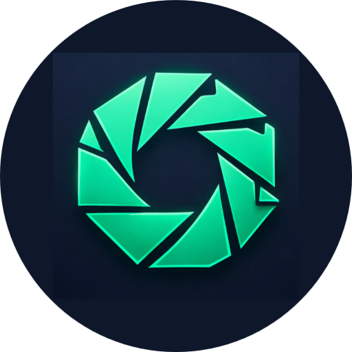

# ✒️ Sahifah Lens (العدسة)

> **Private. Local. Sovereign.**
> A high-performance, local-first document scanner and vault. No accounts, no ads, no cloud.

<div align="center">
<a href="https://lens.openwaqf.org">

</a>
</div>

Sahifah Lens allows users to digitize documents, perform OCR, and organize their personal library directly on their
device. Built on the principle of **Amanah** (Trust), it ensures that your sensitive documents never leave your physical
control. Read our [Local Privacy Policy](PRIVACY_POLICY.md).

---

## 🌟 Key Features

### 🛡️ Privacy & Sovereignty

* **Zero-Cloud Architecture:** Documents are stored in the **Origin Private File System (OPFS)**, isolated from other
  websites.
* **Biometric App Lock:** Immediate re-locking upon app multitasking/resume to prevent unauthorized physical access.
* **Clipboard Auto-Clear (Opt-in):** Clears app-copied text from clipboard after 60 seconds.
* **Stream-Encrypted Backups:** Export your library as a `.slbk` vault using AES-256-GCM with a chunked streaming
  protocol (Magic: `SLBK`).
* **Advanced Mirror Folder (Optional):** Save an extra encrypted `.slbk` copy to a user-chosen local folder after export.
* **Nuclear Reset:** A "Reset Storage" kill-switch erases all local documents and database entries instantly.
* **Inclusive Design:** Optimized for screen readers with semantic labels and high-contrast controls.
* **Offline First:** Fully functional in airplane mode; OCR and image processing are 100% local.

### 📸 Intelligent Scanning & Editing

* **Dual Native Scan Modes:** On Android/iOS, choose `Quick Scan` (native ML scanner, default) or `Manual Scan` (live camera + edge overlay).
* **Native Capture Stabilization:** In manual native mode, capture performs a best-effort AE/AF lock + short settle before shutter to reduce flicker/soft frames.
* **Edge Detection:** Real-time boundary detection via Computer Vision workers.
* **Visual Filter Picker:** Real-time thumbnail previews for Magic Color, B&W, and Whiteboard filters.
* **Quality Presets:** `Archive`, `Share`, and `Original` output policies balance readability, file size, and processing cost. `Original` disables auto-sharpening.
* **Thumb Encoding Policy:** Library/editor thumbnails are encoded as WebP for smaller storage while master pages remain JPEG for compatibility.
* **The "Stitcher":** Merge multiple separate scans into a single organized document.
* **Perspective Correction:** Automatically warps and crops images to fix camera angles.

### 🔍 Deep Search & OCR

* **On-Device OCR:** Uses **Tesseract.js** in WebWorkers to extract text without internet.
* **Arabic PDF Robustness:** Arabic OCR text layers require the bundled `public/fonts/noto-arabic.ttf` font; export fails fast if that asset is missing.
* **Contextual Snippets:** Search results highlight the exact sentence found in OCR text or user notes.
* **Rich Metadata:** Organize with Folders, Tags, and private searchable Notes.
* **PDF Generation:** Compile professional, searchable PDFs with invisible text layers locally.

---

## 🏗️ Technical Architecture

* **UI:** TypeScript + Lit (Web Components) + Tailwind CSS.
* **Persistence:** Dexie.js (IndexedDB) for metadata; OPFS for high-performance binary storage.
* **Crypto:** Web Crypto API using PBKDF2-SHA-256 (`600,000` iterations, `16-byte` random salt) and AES-256-GCM
  (`12-byte` random IV per encrypted chunk).
* **Native:** Capacitor 6+ for high-quality camera access, Biometrics, and native system sharing.
* **Sensory:** Hybrid Haptic engine for tactile feedback on both Web and Native.

---

## 📱 Minimum Platform Targets

* **Android:** API 26+ (8.0), reference performance target tested on mid-range Android class devices (3GB RAM).
* **Web/PWA:** Chrome 86+, Firefox 111+, Safari 15.2+.
* **iOS (Capacitor):** iOS 15+ recommended baseline.

These are product support targets for release validation (performance and compatibility gates), not a guarantee of
identical performance on all hardware tiers.

---

## 🛠️ Developer Setup

### 1. Prerequisites

* **Node.js:** v18 or later.
* **Package Manager:** `npm`.

### 2. Installation

```bash
git clone [https://github.com/open-waqf/lens.git](https://github.com/open-waqf/lens.git)
cd lens
npm install

```

### 3. Development

```bash
npm run dev

```

### 4. Native Setup

```bash
# Android (Ready)
npm run build
npx cap sync
npx cap open android

# iOS (Requires setup)
npm run build
npx cap add ios
npx cap open ios

```

### 5. Performance Gates (Release)

```bash
npm run test:perf
```

Performance gate details and PRD mapping are documented in [docs/perf.md](docs/perf.md).

### 6. Security Network Gate

```bash
npm run test:security
```

Network gate policy, CI flow matrix, and allowlist rules are documented in [docs/security-network.md](docs/security-network.md).

### 7. Android Privacy Smoke (FLAG_SECURE)

CI workflow: `.github/workflows/android-privacy-smoke.yml`

The workflow runs `scripts/android-smoke.ps1` on a self-hosted Windows Android runner and uploads runtime proof artifacts:
- `window-flags.txt` (must contain `FLAG_SECURE check: PASS`)
- `window-windows.txt`
- `screenshot.png`
- `logcat.txt`
- `telemetry-report.txt`

---

## ⚠️ Disclaimers

* **Storage Persistence:**
* **Native App (APK):** Binary files are stored in persistent app-internal storage. Metadata still depends on WebView IndexedDB.
* **Web/PWA:** Managed by the browser. The OS may clear this if storage is low.
* **Recommendation:** Always export an **Encrypted Backup** to secure your data permanently.
* **Storage Cleanup Signal:** If file cleanup partially fails (for example due filesystem/browser restrictions), the app
  surfaces a Storage Cleanup banner that directs you to run **Settings -> Storage Audit**.

* **Vault Format:** `.slbk` header spec is documented in [VAULT_SPEC.md](VAULT_SPEC.md). You can inspect an exported
  backup without decrypting via:

```bash
node scripts/slbk-verify.mjs ./lens-backup-YYYY-MM-DD.slbk
```


* **Sovereignty:** You are responsible for your own keys/passwords. There is no "Forgot Password" link because there is
  no server.

<div align="center">
<p><em>Built with ❤️ for the Ummah and Humanity.</em></p>
<p><small>Released under Polyform Noncommercial License 1.0.0</small></p>
</div>
